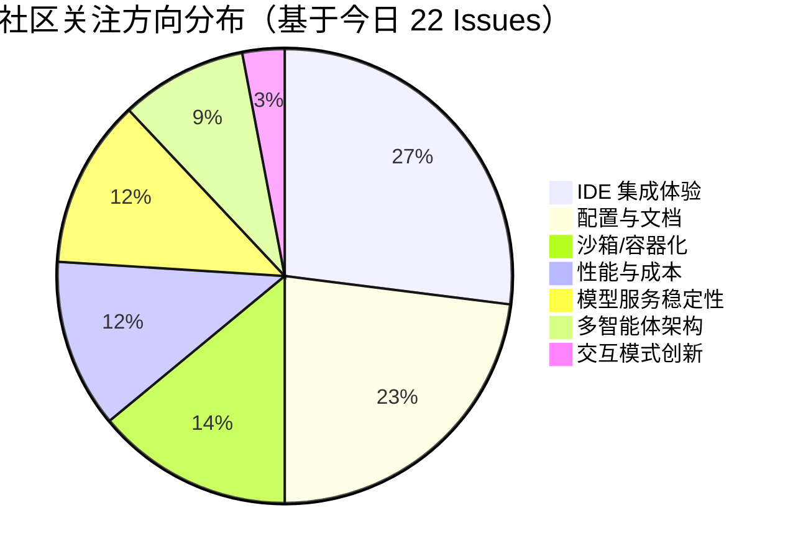

# AI CLI 工具社区动态日报 2026-02-27

> 生成时间: 2026-02-27 00:09 UTC | 覆盖工具: 6 个

- [Claude Code](https://github.com/anthropics/claude-code)
- [OpenAI Codex](https://github.com/openai/codex)
- [Gemini CLI](https://github.com/google-gemini/gemini-cli)
- [Kimi Code CLI](https://github.com/MoonshotAI/kimi-cli)
- [OpenCode](https://github.com/anomalyco/opencode)
- [Qwen Code](https://github.com/QwenLM/qwen-code)
- [Claude Code Skills](https://github.com/anthropics/skills)

---

## 横向对比

# 2026-02-27 AI CLI 工具生态横向对比分析报告

## 1. 生态全景

当前 AI CLI 工具生态呈现**"三极分化、垂直深耕"**格局：Claude Code 与 OpenAI Codex 凭借闭源模型优势主导企业市场，但正遭遇 Windows 稳定性与计费透明度的信任危机；Google Gemini CLI 和 Kimi Code CLI 依托云端模型快速迭代 Agent 架构；OpenCode、Qwen Code 等开源工具则以多模型支持和深度 IDE 集成构建差异化壁垒。整体趋势显示，**MCP 生态治理、沙箱安全机制、远程/自动化工作流**正成为从"玩具级"迈向"生产级"的关键分水岭。

---

## 2. 各工具活跃度对比

| 工具 | 今日新增 Issues | 活跃 PR 数 | 版本发布 | 关键动态 |
|:---|:---:|:---:|:---|:---|
| **Claude Code** | 50+ | 10+ | v2.1.61（紧急修复） | 配置损坏修复引发 regression，社区贡献者 @4RH1T3CT0R7 单日 4 PR |
| **OpenAI Codex** | 50 | 10+ | rust-v0.106.0（稳定版） | 一键安装脚本发布，远程开发需求获 202 👍 |
| **Gemini CLI** | 50 | 9 | v0.30.0-nightly | 47 天 CPU 100% 孤儿进程终修复，Remote Agents Sprint 启动 |
| **Kimi Code CLI** | ~10 | 10 | **v1.15.0** | 数字键选择、标签导航等交互优化密集落地 |
| **OpenCode** | 50 | 12 | v1.2.15 | Windows Bun 段错误修复，内存泄漏修复进稳定通道 |
| **Qwen Code** | 22 | 12 | **v0.11.0** | 模型整合发布，VS Code 辅助侧边栏进入代码审查 |

> **活跃度分层**：Claude Code/Codex/Gemini/OpenCode 处于**高负荷运营期**（50 Issues/日量级），Kimi/Qwen 相对**轻量敏捷**（10-20 Issues/日）。

---

## 3. 共同关注的功能方向

| 功能方向 | 涉及工具 | 具体诉求与紧迫性 |
|:---|:---|:---|
| **🛡️ 沙箱/安全隔离** | Claude Code、OpenCode、Gemini | OpenCode #2242（28 👍）明确要求 seatbelt 级沙箱；Gemini 企业策略引擎 #20058 阻塞 CI/CD 迁移 |
| **💻 远程/自动化工作流** | Codex、Gemini、Qwen | Codex #10450（202 👍）SSH/Remote Hosts 为最高票需求；Gemini Remote Agents 三阶段 Sprint 标记 P0 |
| **🔧 MCP 生态治理** | Claude Code、Kimi | Claude #20412（47 👍）自动注入导致 OOM；Kimi #769 MCP 单点故障应容错而非崩溃 |
| **🖥️ IDE 深度集成** | Codex、Kimi、Qwen、OpenCode | Codex #3550 工作区隔离；Qwen #1954 VS Code 辅助侧边栏；Kimi Xcode Intelligence #1259 |
| **📊 计费/配额透明度** | Claude Code | #29000 Max 计划非确定性计费，#28537 速率限制策略变更未公告——**独有痛点** |
| **⚡ 上下文/压缩优化** | Claude Code、Gemini、Qwen | Claude #24055 32k 输出上限；Gemini "Tactful Extraction" #19561；Qwen #1924 压缩失效 |

---

## 4. 差异化定位分析

| 工具 | 核心模型 | 技术路线 | 目标用户 | 功能侧重 |
|:---|:---|:---|:---|:---|
| **Claude Code** | Claude 3.5/4.x | 闭源、TUI 优先、Remote Control 实验 | 企业开发者、Max 订阅用户 | **长上下文对话**、自动记忆、浏览器集成（Claude-in-Chrome） |
| **OpenAI Codex** | GPT-4o/o3 | 闭源、Rust CLI + TypeScript App 双轨 | VS Code 迁移用户、多 IDE 场景 | **实时协作**、线程恢复、多模态工具输出、企业策略托管 |
| **Gemini CLI** | Gemini 3.x Pro/Flash | 云端优先、A2A 协议、Conductor 扩展 | Google Cloud 生态用户、多 Agent 场景 | **Subagent/Remote Agents**、任务追踪、企业策略即代码 |
| **Kimi Code CLI** | Kimi k1.5/k2.x | 闭源、WebUI/CLI 功能对齐 | 中文开发者、Moonshot API 用户 | **交互效率**（数字键、标签导航）、MCP 稳健性、苹果生态 |
| **OpenCode** | 多模型（Claude/GPT/本地） | 开源、Bun 运行时、Desktop + TUI | 多模型策略用户、隐私敏感场景 | **模型中立性**、LiteLLM 原生支持、会话管理（fork/edit/revert） |
| **Qwen Code** | Qwen 3.x Coder/Plus | 开源、VS Code 深度集成、阿里云生态 | 中文企业用户、阿里云百炼客户 | **IDE 原生体验**、百炼服务集成、Agent Swarm 架构探索 |

**关键差异信号**：
- **闭源 vs 开源**：Claude/Codex/Gemini/Kimi 聚焦端到端体验控制；OpenCode/Qwen 以开放架构换取灵活性
- **单模型 vs 多模型**：仅 OpenCode 将"模型中立"作为核心卖点，其余均深度绑定自有模型
- **TUI vs IDE**：Codex 双轨并行，Qwen 押注 VS Code 原生，Claude 探索浏览器集成

---

## 5. 社区热度与成熟度

| 象限 | 工具 | 判断依据 |
|:---|:---|:---|
| **🔥 高热度·高成熟** | Claude Code、OpenAI Codex | Issues 量级最大，但痛点集中于**运营层面**（计费、Windows 稳定性）而非架构缺失；企业用户占比高 |
| **🔥 高热度·快速迭代** | Gemini CLI、OpenCode | Gemini Remote Agents 战略级投入，OpenCode 内存泄漏/沙箱等**基础工程问题**密集修复 |
| **🌱 中等热度·功能深耕** | Kimi Code CLI | v1.15.0 交互优化密集，但 MCP/IDE 集成仍处追赶期；社区规模小但响应快 |
| **🌱 中等热度·架构探索** | Qwen Code | v0.11.0 模型整合完成，但 Agent 配置黑盒化、Hook 机制缺失等**设计债务**待解 |

**成熟度警示**：
- **Claude Code**：配置系统可靠性危机（v2.1.61 regression）显示**基础设施债务**
- **Gemini CLI**：47 天孤儿进程修复反映**进程管理深层问题**
- **OpenCode**：沙箱机制缺失成为**企业采用硬性阻断**

---

## 6. 值得关注的趋势信号

| 趋势 | 证据链 | 开发者参考价值 |
|:---|:---|:---|
| **MCP 从"功能"变为"治理"议题** | Claude #20412 自动注入 OOM、Kimi #769 容错机制诉求 | 生产环境需评估 MCP 服务器的**资源隔离与故障域控制** |
| **沙箱安全成为企业采购硬性门槛** | OpenCode #2242 28 👍 明确对比 seatbelt，Gemini 企业策略引擎优先 | 评估工具时需验证：**文件系统隔离、网络 egress 控制、权限审计** |
| **"Remote" 重新定义开发工作流** | Codex #10450 202 👍 SSH 需求，Gemini Remote Agents Sprint，Claude Remote Control 权限混乱 | **本地-云端-远程主机**的三层架构正在形成，需关注会话状态同步与跨环境一致性 |
| **计费透明度危机催生审计需求** | Claude #29000 非确定性计费、#28537 策略变更未公告 | 企业用户应要求：**token 级计费明细、配额预警 API、用量归因** |
| **Agent 架构从"单智能体"向"多智能体协作"演进** | Gemini Subagent 默认启用、Qwen #1816 Agent Swarm、Claude MCP 多服务器 | 设计工作流时需考虑：**Agent 间通信协议（A2A）、任务分解策略、结果聚合机制** |
| **IDE 集成从"插件"变为"原生能力"** | Qwen VS Code 辅助侧边栏、Codex 工作区隔离、Kimi Xcode Intelligence | 选型标准升级：**LSP 合规性、编辑器上下文感知、快捷键冲突处理** |

---

**结论**：当前 AI CLI 工具正处于从"演示可用"向"生产可靠"的关键跃迁期。开发者选型建议：**短期看模型质量与交互体验，中期看 MCP/沙箱生态成熟度，长期看多 Agent 协作与跨环境一致性架构**。Windows 稳定性、计费透明度、企业安全合规将是 2026 年上半年的决胜战场。

---

## 各工具详细报告

<details>
<summary><strong>Claude Code</strong> — <a href="https://github.com/anthropics/claude-code">anthropics/claude-code</a></summary>

## Claude Code Skills 社区热点

> 数据来源: [anthropics/skills](https://github.com/anthropics/skills)

# Claude Code Skills 社区热点报告（2026-02-27）

---

## 1. 热门 Skills 排行（按社区关注度）

| 排名 | Skill | 功能概述 | 状态 | 链接 |
|:---|:---|:---|:---|:---|
| 1 | **skill-quality-analyzer + skill-security-analyzer** | 元技能：对 Claude Skills 进行五维度质量评估（结构文档、功能完整性等）及安全审计 | 🟡 Open | [#83](https://github.com/anthropics/skills/pull/83) |
| 2 | **codebase-inventory-audit** | 代码库清理与文档审计，识别孤儿代码、未使用文件、文档缺口等10步工作流 | 🟡 Open | [#147](https://github.com/anthropics/skills/pull/147) |
| 3 | **SAP-RPT-1-OSS predictor** | 集成 SAP 开源表格基础模型，用于 SAP 业务数据的预测分析 | 🟡 Open | [#181](https://github.com/anthropics/skills/pull/181) |
| 4 | **ShieldCortex** | 持久化内存系统 + AI Agent 内置安全机制，支持跨会话记忆与威胁防护 | 🟡 Open | [#386](https://github.com/anthropics/skills/pull/386) |
| 5 | **AURELION skill suite** | 四件套：结构化认知框架（kernel）、专业顾问（advisor）、执行代理（agent）、记忆系统（memory） | 🟡 Open | [#444](https://github.com/anthropics/skills/pull/444) |
| 6 | **masonry-generate-image-and-videos** | Masonry CLI 集成，支持 Imagen 3.0/Veo 3.1 的图文生成与任务管理 | 🟡 Open | [#335](https://github.com/anthropics/skills/pull/335) |
| 7 | **frontend-design（改进版）** | 优化前端设计技能的可操作性，确保单轮对话内可执行的具体指令 | 🟡 Open | [#210](https://github.com/anthropics/skills/pull/210) |
| 8 | **Buildr** | Telegram 桥接，手机端控制 Claude Code 会话、转发权限、停止任务 | 🟡 Open | [#419](https://github.com/anthropics/skills/pull/419) |

---

## 2. 社区需求趋势（Issues 提炼）

| 需求方向 | 代表 Issue | 核心诉求 |
|:---|:---|:---|
| **MCP 协议集成** | [#16](https://github.com/anthropics/skills/issues/16), [#369](https://github.com/anthropics/skills/issues/369) | 将 Skills 暴露为 MCP 工具，实现标准化 API 调用；MCP Apps 支持 |
| **Agent 治理与安全** | [#412](https://github.com/anthropics/skills/issues/412) | 策略执行、威胁检测、信任评分、审计追踪等 AI Agent 系统治理模式 |
| **Skills 包管理器** | [#185](https://github.com/anthropics/skills/issues/185) | 社区项目 Skills MCP：跨平台（Claude/Cursor/Windsurf）的 Skill 安装/更新/依赖管理 |
| **Bedrock 兼容** | [#29](https://github.com/anthropics/skills/issues/29) | AWS Bedrock 环境下的 Skills 使用方案 |
| **skill-creator 重构** | [#202](https://github.com/anthropics/skills/issues/202) | 从"开发者文档"转向"可操作指令"，提升 token 效率，修正命名规范 |
| **开源许可宽松化** | [#100](https://github.com/anthropics/skills/issues/100) | 示例项目采用更宽松许可，便于社区二次开发 |

---

## 3. 高潜力待合并 Skills（近期可能落地）

| Skill | 亮点 | 待解决 | 链接 |
|:---|:---|:---|:---|
| **8-skills foundation series** | 教程构建器、测验生成器、无障碍审计、数据叙事等基础设施级技能 | 批量审查 | [#288](https://github.com/anthropics/skills/pull/288) |
| **skill-creator UTF-8 修复** | 解决多字节字符导致的 Rust panic，影响中文/日文用户 | 代码审查中 | [#362](https://github.com/anthropics/skills/pull/362) |
| **SKILL.md 大小写文档澄清** | 修复 `skill.md` vs `SKILL.md` 导致的静默加载失败，显著改善 DX | 文档审查 | [#356](https://github.com/anthropics/skills/pull/356) |
| **webapp-testing requirements.txt** | 解决 Playwright 依赖的重复安装问题 | 轻量修复，易合并 | [#282](https://github.com/anthropics/skills/pull/282) |

---

## 4. Skills 生态洞察

> **核心诉求：从"单点工具"走向"系统化基础设施"** —— 社区正推动 Skills 向三大方向演进：标准化协议层（MCP）、全生命周期治理（质量审计/安全/Agent 治理）、以及跨平台可移植性（包管理器/Bedrock 兼容），同时迫切要求官方改善开发者体验（文档、工具链稳定性、许可政策）。

---

*数据截止：2026-02-27 | 来源：github.com/anthropics/skills*

---

# Claude Code 社区动态日报 | 2026-02-27

## 今日速览

Anthropic 紧急发布 v2.1.61 修复 Windows 平台并发写入导致配置文件损坏的严重问题，但该补丁本身又引发数据丢失的新报告。社区围绕 **Remote Control 功能权限混乱**、**配额计费不透明** 以及 **Windows 平台稳定性** 三大议题持续发酵，单日新增 50+ Issues 显示用户规模快速扩张带来的支持压力。

---

## 版本发布

### v2.1.61（2026-02-26）
- **关键修复**：解决 Windows 平台并发写入导致 `.claude.json` 配置文件损坏的问题（[#28847](https://github.com/anthropics/claude-code/issues/28847)）
- **⚠️  regression 警报**：有用户报告升级后配置被完全清空（[#29165](https://github.com/anthropics/claude-code/issues/29165)）

### v2.1.59（2026-02-26）
- **自动记忆**：Claude 自动保存有用上下文至 auto-memory，通过 `/memory` 管理
- **交互式复制**：新增 `/copy` 命令，支持选择单个代码块或完整响应
- **权限优化**：改进 "always allow" 前缀建议

---

## 社区热点 Issues

| 优先级 | Issue | 核心问题 | 社区反应 |
|:---|:---|:---|:---|
| 🔴 P0 | [#24055](https://github.com/anthropics/claude-code/issues/24055) API Error: 输出 token 超 32k 上限 | 生产环境高频触发，69 评论，52 👍，用户要求紧急修复或提供流式输出方案 | 大规模影响，企业用户受阻 |
| 🔴 P0 | [#28847](https://github.com/anthropics/claude-code/issues/28847) 多实例并发写入损坏配置（已关闭） | 22 评论，25 👍，用户贡献了详细复现和根因分析 | 推动 v2.1.61 紧急发布 |
| 🟡 P1 | [#21576](https://github.com/anthropics/claude-code/issues/21576) Windows 任务执行逃逸至 PowerShell 无响应 | 38 评论，长期存在的 Windows TUI 稳定性问题，影响自动化工作流 | 企业 Windows 用户痛点 |
| 🟡 P1 | [#23828](https://github.com/anthropics/claude-code/issues/23828) Claude-in-Chrome Windows/WSL 完全失效 | 21 评论，Bun stdin crash + socket 路径发现双重 bug，浏览器集成受阻 | 跨平台体验断裂 |
| 🟡 P1 | [#20412](https://github.com/anthropics/claude-code/issues/20412) MCP 服务器自动注入导致 OOM | 15 评论，47 👍，Claude.ai 配置静默同步至 CLI，无 opt-out 机制 | 资源受限系统致命问题 |
| 🟡 P1 | [#29000](https://github.com/anthropics/claude-code/issues/29000) 配额计费非确定性：65% 会话消耗于极少 token | 13 评论，11 👍，Max 计划用户质疑计费透明度，要求详细审计日志 | 付费用户信任危机 |
| 🟡 P1 | [#28537](https://github.com/anthropics/claude-code/issues/28537) 使用限制比以往更快触发 | 14 评论，用户怀疑速率限制策略变更未公告 | API 策略透明度问题 |
| 🟢 P2 | [#13008](https://github.com/anthropics/claude-code/issues/13008) OSC 8 超链接支持可点击文件路径 | 13 评论，23 👍，终端用户体验增强，Kitty/iTerm2/Windows Terminal 支持 | 开发者体验优化 |
| 🟢 P2 | [#28833](https://github.com/anthropics/claude-code/issues/28833) Max 计划 Remote Control 不可用 | 7 评论，3 👍，功能权限与订阅状态不同步 | 新功能推广混乱 |
| 🔴 P0 | [#29165](https://github.com/anthropics/claude-code/issues/29165) **v2.1.61 升级后配置完全丢失** | 2 评论，regression 警报，MCP 和设置全部清空 | 紧急跟进中 |

---

## 重要 PR 进展

| PR | 作者 | 内容 | 状态 |
|:---|:---|:---|:---|
| [#29077](https://github.com/anthropics/claude-code/pull/29077) | @4RH1T3CT0R7 | **RFC: 修复 `~/.claude.json` 并发写入竞态条件** — 逆向分析 v2.1.59 提出完整方案，影响 30+ issues | ✅ 已关闭（已采纳） |
| [#29097](https://github.com/anthropics/claude-code/pull/29097) | @4RH1T3CT0R7 | 安全提醒钩子输出结构化 JSON，确保模型接收安全警告（原 stderr 输出模型不可见） | 🔄 Open |
| [#29095](https://github.com/anthropics/claude-code/pull/29095) | @4RH1T3CT0R7 | 修复 hookify 插件：同时搜索项目目录和 home 目录规则文件 | 🔄 Open |
| [#29092](https://github.com/anthropics/claude-code/pull/29092) | @4RH1T3CT0R7 | Windows 路径安全检查：反斜杠规范化，修复 GitHub Actions 工作流提醒被跳过 | 🔄 Open |
| [#29091](https://github.com/anthropics/claude-code/pull/29091) | @4RH1T3CT0R7 | Python 3.8 兼容：使用 `typing.Tuple` 替代 `tuple[]` | 🔄 Open |
| [#29012](https://github.com/anthropics/claude-code/pull/29012) | @mmostagirbhuiyan | 新增会话管理插件：`/fork`、`/move`、`/sessions` 跨目录迁移对话历史 | 🔄 Open |
| [#28714](https://github.com/anthropics/claude-code/pull/28714) | @karljtaylor | 自动化 Issue 分类 + 周报摘要：Haiku 4.5 单 issue 分类，Sonnet 4.6 周报，月成本 ~$0.25 | 🔄 Open |
| [#28850](https://github.com/anthropics/claude-code/pull/28850) | @SageRish | 文档：明确 Windows 安装命令需 PowerShell 而非 CMD | 🔄 Open |
| [#13307](https://github.com/anthropics/claude-code/pull/13307) | @longregen | 可移植 shebang：`#!/usr/bin/env bash` 替代 `#!/bin/bash` | 🔄 Open |
| [#28967](https://github.com/anthropics/claude-code/pull/28967) | @OctavianGuzu | oncall-triage 工作流超时调整：15→25 分钟 | ✅ 已关闭 |

> **社区贡献亮点**：@4RH1T3CT0R7 单日提交 4 个高质量修复 PR，覆盖安全、跨平台兼容和配置系统，并主导了竞态条件 RFC。

---

## 功能需求趋势

基于 50 条 Issues 分析，社区关注焦点集中于：

| 方向 | 代表 Issue | 需求强度 |
|:---|:---|:---:|
| **计费透明度** | #29000, #28848, #28537 | ⭐⭐⭐⭐⭐ |
| **Windows 平台稳定性** | #21576, #23828, #28847, #28401 | ⭐⭐⭐⭐⭐ |
| **Remote Control 功能完善** | #28833, #28884, #28508 | ⭐⭐⭐⭐☆ |
| **MCP 生态治理** | #20412（自动注入）、配置隔离 | ⭐⭐⭐⭐☆ |
| **输出长度/流式处理** | #24055（32k 限制） | ⭐⭐⭐⭐☆ |
| **终端体验增强** | #13008（OSC 8 超链接）、#23623（状态栏定制） | ⭐⭐⭐☆☆ |
| **安全/隐私** | #29121（bug 报告泄露敏感信息）、#18290（git 危险操作确认） | ⭐⭐⭐⭐☆ |

---

## 开发者关注点

### 🔥 紧急痛点
1. **配置系统可靠性危机**：`.claude.json` 损坏问题从 v2.1.59 持续至 v2.1.61，修复补丁本身引发数据丢失（#29165），用户信任受损
2. **Windows 二等公民体验**：安装、TUI、浏览器集成、路径处理等多维度问题，企业 Windows 部署受阻

### 📊 计费与配额焦虑
- Max 计划用户集中反馈**非确定性计费**：相同使用量消耗配额波动大，缺乏细粒度审计工具
- 需求：`ccusage` 增强、实时配额预警、计费明细导出

### 🔄 功能权限混乱
- Remote Control 功能在 Max 计划中可用性不一致，文档与实际行为不符
- Claude.ai 与 Claude Code 的 MCP 配置同步缺乏 opt-out，造成资源冲突

### 🛡️ 安全与自动化
- 用户发现 Claude 生成的 bug 报告包含**组织名称、仓库 URL、文件路径**等敏感信息（#29121）
- 危险 git 操作（如 `git checkout` 丢弃更改）确认机制失效（#18290）

---

*日报基于 GitHub 公开数据生成，关注 [anthropics/claude-code](https://github.com/anthropics/claude-code) 获取最新动态*

</details>

<details>
<summary><strong>OpenAI Codex</strong> — <a href="https://github.com/openai/codex">openai/codex</a></summary>

# OpenAI Codex 社区动态日报 | 2026-02-27

---

## 1. 今日速览

今日 Codex 发布 **Rust CLI v0.106.0 稳定版**，新增 macOS/Linux 一键安装脚本；社区热议 **远程开发支持**（SSH/Remote Hosts）需求获 202 👍，同时 **Python UV 环境兼容性问题** 已修复关闭。TUI 界面渲染与认证问题仍是开发者反馈焦点。

---

## 2. 版本发布

### rust-v0.106.0（稳定版）
- **一键安装脚本**：新增 macOS/Linux 直接安装脚本，作为 GitHub Release 资产发布，包含 `codex` 和 `rg` 平台载荷
- **App-Server v2 线程 API 扩展**：实验性支持线程级实时端点/通知功能

### rust-v0.107.0-alpha.1 & 多个 0.106.0-alpha 版本
- 持续迭代中的预发布版本，为下一版稳定版做准备

🔗 [Release 页面](https://github.com/openai/codex/releases)

---

## 3. 社区热点 Issues（精选 10 项）

| # | Issue | 类型 | 重要性 | 社区反应 |
|---|-------|------|--------|---------|
| [#10450](https://github.com/openai/codex/issues/10450) | **远程开发支持（SSH/Remote Hosts）** | 功能请求 | ⭐⭐⭐ 填补 VS Code 迁移用户的核心痛点 | **202 👍**，28 评论，开发者强烈呼吁桌面版支持远程主机开发 |
| [#1457](https://github.com/openai/codex/issues/1457) | **Python UV 环境失败** [已修复] | Bug | ⭐⭐⭐ UV 是现代 Python 生态主流工具链 | 58 评论，43 👍，已关闭，解决 pre-commit 等工具兼容性问题 |
| [#12764](https://github.com/openai/codex/issues/12764) | **CLI 401 未授权错误** | Bug | ⭐⭐⭐ 阻断性认证问题 | 20 评论，影响 0.104.0 版本，Cloudflare 边缘节点相关 |
| [#6427](https://github.com/openai/codex/issues/6427) | **TUI 滚动时消息截断** | Bug | ⭐⭐⭐ 核心交互体验缺陷 | 20 评论，17 👍，长对话场景严重影响可用性 |
| [#3550](https://github.com/openai/codex/issues/3550) | **VS Code 扩展：按工作区隔离对话** | 功能请求 | ⭐⭐ 项目管理刚需 | 34 👍，12 评论，跨项目对话混杂是组织痛点 |
| [#12754](https://github.com/openai/codex/issues/12754) | **macOS App 崩溃（调用栈溢出）** | Bug | ⭐⭐⭐ 稳定性问题 | 14 👍，11 评论，多 Python 项目工作空间触发 |
| [#12749](https://github.com/openai/codex/issues/12749) | **禁用 diff 背景高亮选项** | 功能请求 | ⭐⭐ 可访问性/个性化需求 | 11 评论，6 👍，#12581 引入的新样式引发可读性争议 |
| [#12904](https://github.com/openai/codex/issues/12904) | **Windows Warp 终端颜色不可读** | Bug | ⭐⭐ 跨平台兼容性 | 10 评论，3 👍，Windows 终端渲染问题持续 |
| [#5716](https://github.com/openai/codex/issues/5716) | **交换 Enter/Ctrl+Enter 默认行为** | 功能请求 | ⭐⭐ 输入效率优化 | 14 👍，9 评论，多行输入场景高频误触 |
| [#12955](https://github.com/openai/codex/issues/12955) | **思考状态 spinner 持久化（线程状态不同步）** | Bug | ⭐⭐ 状态管理缺陷 | 9 评论，涉及本地会话状态检测与恢复机制 |

---

## 4. 重要 PR 进展（精选 10 项）

| # | PR | 作者 | 核心内容 |
|---|-----|------|---------|
| [#12612](https://github.com/openai/codex/pull/12612) | 统一 rollout 重建与 resume/fork 元数据 | @charley-oai | 重构会话历史重建逻辑，replay 元数据与模型可见历史统一构建，提升会话恢复可靠性 |
| [#12964](https://github.com/openai/codex/pull/12964) | execpolicy: 添加 host_executable() 路径映射 | @bolinfest | 解决绝对路径 `/usr/bin/git` 与规则 `["git"]` 不匹配问题，为更灵活的命令策略奠基 |
| [#12389](https://github.com/openai/codex/pull/12389) | 托管文件系统 deny_read 黑名单 | @viyatb-oai | 从 `requirements.toml` 强制执行读取黑名单，企业安全合规关键功能 |
| [#12948](https://github.com/openai/codex/pull/12948) | 多模态自定义工具输出 | @fjord-oai | `custom_tool_call_output` 支持结构化内容（如图像），`js_repl` 可返回嵌套 `view_image` 结果 |
| [#12850](https://github.com/openai/codex/pull/12850) | 实时音频设备选择器 | @aibrahim-oai | 新增 `/audio` 选择器，支持麦克风/扬声器选择，持久化配置，仅重启本地音频 |
| [#12936](https://github.com/openai/codex/pull/12936) | 后台刷新 requirements 本地缓存 | @alexsong-oai | 缓存 TTL 30 分钟，后台 5 分钟刷新，确保策略及时更新 |
| [#12560](https://github.com/openai/codex/pull/12560) | `thread/resume` 重放待处理请求 | @euroelessar | 断线重连后自动重放审批/输入请求，跨客户端状态同步 |
| [#12956](https://github.com/openai/codex/pull/12956) | 修复 TUI 启动时标题垂直偏移 | @rhan-oai | 移除冗余 `flush_active_cell`，解决启动时界面抖动 |
| [#12584](https://github.com/openai/codex/pull/12584) | 通过 shell-escalation 实现 zsh 工具 | @bolinfest | Unix 专属 zsh 路径，显式启用时才特权提升，替代旧版桥接方案 |
| [#12944](https://github.com/openai/codex/pull/12944) | 按字母序排列功能列表 | @bolinfest | `codex features list` 输出排序，提升可扫描性 |

---

## 5. 功能需求趋势

基于今日 50 条 Issue 分析，社区关注焦点集中在：

| 方向 | 热度 | 典型诉求 |
|------|------|---------|
| **IDE/编辑器生态集成** | 🔥🔥🔥 | VS Code 工作区隔离、Cursor/Windsurf 支持、自定义编辑器"Open In"菜单 |
| **远程与多环境开发** | 🔥🔥🔥 | SSH/Remote Hosts、CLI ↔ App 会话互通、容器/云开发环境 |
| **TUI/终端体验优化** | 🔥🔥🔥 | 滚动渲染、颜色主题、键位自定义、diff 可读性 |
| **企业安全与合规** | 🔥🔥 | 命令白名单、文件读取黑名单、托管权限策略 |
| **认证与稳定性** | 🔥🔥 | 401 错误、BYO API Key、Intel Mac 兼容性、CPU 占用过高 |
| **多模态与实时交互** | 🔥 | 音频设备选择、实时 API、图像输出支持 |

---

## 6. 开发者关注点

### 🔴 高频痛点
1. **认证与授权不稳定** — 401 错误、BYO API Key 登录失败、Azure 加密内容验证失败
2. **跨平台兼容性** — Windows 终端渲染、Intel Mac 安装错误、UV/Poetry 等现代 Python 工具链
3. **状态同步与恢复** — 线程状态不同步、思考 spinner 卡死、会话恢复可靠性

### 🟡 体验优化诉求
- **输入效率**：Enter 提交 vs 换行的可配置性
- **视觉可访问性**：diff 高亮、颜色对比度、滚动稳定性
- **工作流连续性**：CLI/App 会话互通、自动化调度可靠性

### 🟢 企业级需求
- 细粒度权限控制（白名单 > 黑名单）
- 审计与合规策略托管
- 远程/隔离开发环境支持

---

*日报基于 GitHub openai/codex 公开数据生成*

</details>

<details>
<summary><strong>Gemini CLI</strong> — <a href="https://github.com/google-gemini/gemini-cli">google-gemini/gemini-cli</a></summary>

# Gemini CLI 社区动态日报 | 2026-02-27

## 今日速览

今日社区聚焦三大主线：**终端体验优化**（Ctrl+C 取消压缩、环境变量修复）、**Agent 架构演进**（Remote Agents 三阶段 Sprint 启动、Subagent 即将默认启用），以及一个困扰用户 47 天的 **CPU 100% 孤儿进程问题终被修复**。Google 团队正加速推进企业级功能与多 Agent 协作基础设施。

---

## 版本发布

**v0.30.0-nightly.20260226.f9f916e1d** 已发布
- 新增 Gemini 3.1 Pro Preview 行为评估支持
- 引入 PR 速率限制功能（`feat:PR-rate-limit`）
- MCP 工具审批时支持展开完整详情

---

## 社区热点 Issues

| 优先级 | Issue | 核心看点 | 社区反应 |
|:---|:---|:---|:---|
| 🔴 **P1** | [#15874](https://github.com/google-gemini/gemini-cli/issues/15874) **孤儿进程 CPU 100% 问题** | 运行 47+ 天的僵尸进程终被修复，涉及信号处理与进程生命周期管理 | 51 条评论，长期痛点终于关闭 |
| 🔴 **P1** | [#20444](https://github.com/google-gemini/gemini-cli/issues/20444) **终端编辑器失效** | `TERM`/`COLORTERM` 环境变量缺失导致 Vim/Emacs 无法初始化 | 影响核心开发体验，已快速跟进 PR |
| 🔴 **P1** | [#20058](https://github.com/google-gemini/gemini-cli/issues/20058) **Headless 模式策略引擎** | 企业 CI/CD 场景必需，阻塞旧配置废弃迁移 | 企业用户关键需求 |
| 🟡 **P2** | [#20405](https://github.com/google-gemini/gemini-cli/issues/20405) **Ctrl+C 无法取消压缩请求** | 聊天压缩时的 API 调用无法中断，用户体验瑕疵 | 技术债务，已有 PR 修复 |
| 🟡 **P2** | [#20142](https://github.com/google-gemini/gemini-cli/issues/20142) **AskUser 支持 Ctrl+R 历史搜索** | 交互式提问场景的效率提升 | 8 条评论，开发者高频诉求 |
| 🟡 **P2** | [#18953](https://github.com/google-gemini/gemini-cli/issues/18953) **复杂 Shell 命令执行缓慢** | 进度动画与 "魔法" 输出导致 100 倍性能下降 | 影响 Agent 实际可用性 |
| 🟢 **Feature** | [#20302](https://github.com/google-gemini/gemini-cli/issues/20302) **[Epic] Remote Agents Sprint 1** | 远程 Agent 基础设施与流式支持，A2A 协议核心 | 标记为 P0，战略级功能 |
| 🟢 **Feature** | [#20177](https://github.com/google-gemini/gemini-cli/issues/20177) **AskUser 替代标准工具确认** | 简单命令仍需人工切换确认，打断心流 | 4 条评论，UX 优化方向 |
| 🟢 **Feature** | [#20181](https://github.com/google-gemini/gemini-cli/issues/20181) **AskUser 支持外部编辑器** | 长文本回答场景（如 Conductor 轨道描述） | 与 #17721 编辑器支持联动 |
| 🟢 **Feature** | [#19561](https://github.com/google-gemini/gemini-cli/issues/19561) **"Tactful Extraction" 精准代码读取** | 36.6k tokens/turn 基线优化，减少 +15k tokens 膨胀 | 上下文成本优化，长期架构方向 |

---

## 重要 PR 进展

| PR | 作者 | 功能/修复内容 | 状态 |
|:---|:---|:---|:---|
| [#20515](https://github.com/google-gemini/gemini-cli/pull/20515) | @deadsmash07 | **修复 Ctrl+C 无法取消聊天压缩** — 将 abort signal 从 `processTurn` 穿透至压缩服务 | 🆕 新开 |
| [#20514](https://github.com/google-gemini/gemini-cli/pull/20514) | @deadsmash07 | **修复终端编辑器环境变量** — 白名单 `TERM`/`COLORTERM` 解决 Vim/Emacs 失效 | 🆕 新开 |
| [#20517](https://github.com/google-gemini/gemini-cli/pull/20517) | @jacob314 | **修复搜索底部边框颜色** — 视觉回归测试配套 | 🆕 新开 |
| [#20509](https://github.com/google-gemini/gemini-cli/pull/20509) | @bdmorgan | **CodeAssistServer 重试逻辑覆盖 OAuth 用户** — 补全 #20432 遗漏场景 | 🆕 新开 |
| [#20510](https://github.com/google-gemini/gemini-cli/pull/20510) | @SandyTao520 | **A2A 远程 Agent HTTP 认证支持** — Bearer/Basic/Digest 全方案 | 🆕 新开 |
| [#20361](https://github.com/google-gemini/gemini-cli/pull/20361) | @spencer426 | **企业策略自动持久化** — "Allow for this session" 默认写入策略文件 | 更新中 |
| [#20378](https://github.com/google-gemini/gemini-cli/pull/20378) | @joshualitt | **Subagent 结果展示优化** — 修复 #18289 输出体验 | 更新中 |
| [#19489](https://github.com/google-gemini/gemini-cli/pull/19489) | @anj-s | **Task Tracker CRUD 与可视化** — Phase 2 完整实现，ASCII 树形渲染 | 持续迭代 |
| [#16965](https://github.com/google-gemini/gemini-cli/pull/16965) | @yuvrajangadsingh | **孤儿进程 CPU 100% 修复** — SIGHUP 信号处理与进程清理 | ✅ 已合并 |
| [#17231](https://github.com/google-gemini/gemini-cli/pull/17231) | @sidwan02 | **Gemma 本地模型路由实验** — LiteRT-LM shim 集成 | ❌ 已关闭 |

---

## 功能需求趋势

基于 50 条活跃 Issue 分析，社区关注呈现 **四大聚类**：

| 方向 | 代表 Issue | 热度 |
|:---|:---|:---:|
| **Agent 架构 2.0** | Remote Agents 三 Sprint、Subagent 默认启用、A2A 认证 | 🔥🔥🔥🔥🔥 |
| **终端原生体验** | 环境变量、Ctrl+C 中断、历史搜索、外部编辑器 | 🔥🔥🔥🔥🔥 |
| **企业级治理** | Headless 策略引擎、自动策略持久化、审计追踪 | 🔥🔥🔥🔥 |
| **性能与成本** | 上下文压缩、Token 精准提取、长命令优化 | 🔥🔥🔥🔥 |

> 注：Agent 相关 Issue 中 **🔒 maintainer only** 标签占比超 60%，显示该领域处于 Google 内部主导的快速迭代期。

---

## 开发者关注点

### 🔴 高频痛点
1. **进程稳定性** — #15874 的 47 天 CPU 占用的极端案例，反映信号处理与守护进程管理的深层问题
2. **中断响应** — 压缩请求、API 调用等后台操作无法及时取消，"假死" 体验
3. **终端兼容性** — 环境变量传递、颜色渲染、编辑器集成等 POSIX 合规细节

### 🟡 能力期待
- **更智能的 Agent 协作** — Subagent → Remote Agents 的渐进式能力开放
- **工程化成熟度** — 策略即代码、CI/CD 原生支持、可观测性（OTEL 追踪增强 #20237）

### 🟢 生态信号
- Conductor 扩展的深度集成（自定义计划目录 #20344、策略提供 #20060）
- 内部工具链（如 Task Tracker #19489）正从实验走向产品化

</details>

<details>
<summary><strong>Kimi Code CLI</strong> — <a href="https://github.com/MoonshotAI/kimi-cli">MoonshotAI/kimi-cli</a></summary>

# Kimi Code CLI 社区动态日报 | 2026-02-27

## 今日速览

Kimi Code CLI 今日发布 **v1.15.0**，带来多项交互体验优化：支持数字键快速选择权限选项、标签式多问题导航、进程标题规范化等。社区持续聚焦 **MCP 稳定性** 与 **IDE 生态集成**两大主题，Xcode Intelligence 支持等新需求涌现。

---

## 版本发布

### v1.15.0 已发布
**发布日期**: 2026-02-26 | [Release 详情](https://github.com/MoonshotAI/kimi-cli/releases/tag/1.15.0)

| 类别 | 更新内容 |
|:---|:---|
| **交互优化** | 权限面板支持 `1-5` 数字键快速选择，与 WebUI 保持功能一致 |
| **导航增强** | 标签式多问题导航，支持状态持久化与恢复 |
| **视觉改进** | Shell 提示符简化（移除用户名前缀）、工具栏增加分隔线与快捷键提示 |
| **底层能力** | CLI 进程标题设为 `Kimi Code`，Web Worker 标记为 `kimi-code-worker` |

---

## 社区热点 Issues

| # | 状态 | 标题 | 核心看点 |
|:---|:---|:---|:---|
| [#769](https://github.com/MoonshotAI/kimi-cli/issues/769) | 🔵 OPEN | MCP 连接失败时不应自动退出 | **高赞需求（👍3）**：用户呼吁与 Codex/Claude Code 保持一致，单点故障不应阻断整体使用，反映 MCP 容错机制设计争议 |
| [#751](https://github.com/MoonshotAI/kimi-cli/issues/751) | 🔵 OPEN | Slash 命令选中后立即执行 | 交互细节优化：当前需二次回车确认，用户希望减少操作步骤 |
| [#1249](https://github.com/MoonshotAI/kimi-cli/issues/1249) | 🔵 OPEN | `new session` 时检测命令行环境 | PowerShell 用户痛点：AI 误用 bash 命令导致返工，需将当前 shell 注入系统提示词 |
| [#1252](https://github.com/MoonshotAI/kimi-cli/issues/1252) | 🔵 OPEN | 权限选项增加数字键选择 | **v1.15.0 已部分实现**：社区推动 CLI 与 WebUI 功能对齐 |
| [#1054](https://github.com/MoonshotAI/kimi-cli/issues/1054) | 🔵 OPEN | Zed ACP 无法识别当前处理文件 | IDE 集成问题：编辑器上下文感知能力待增强 |
| [#1248](https://github.com/MoonshotAI/kimi-cli/issues/1248) | 🔵 OPEN | kimi-cli 与 MCP 运行冲突 | `notifications/initialized` 消息触发 ValidationError，MCP 协议兼容性待修复 |
| [#1259](https://github.com/MoonshotAI/kimi-cli/issues/1259) | ✅ CLOSED | 支持 Xcode Intelligence | 苹果生态接入需求，已快速关闭可能已内部排期 |
| [#1253](https://github.com/MoonshotAI/kimi-cli/issues/1253) | ✅ CLOSED | MCP 服务器启动冲突 | 同日创建关闭，v1.15.0 可能已包含相关修复 |
| [#1250](https://github.com/MoonshotAI/kimi-cli/issues/1250) | ✅ CLOSED | 401 模型获取失败 | 认证问题，快速响应关闭 |
| [#1227](https://github.com/MoonshotAI/kimi-cli/issues/1227) | ✅ CLOSED | LLM 提供商连接错误 | 网络层问题已解决 |

---

## 重要 PR 进展

| # | 状态 | 作者 | 核心贡献 |
|:---|:---|:---|:---|
| [#1258](https://github.com/MoonshotAI/kimi-cli/pull/1258) | ✅ MERGED | @RealKai42 | **v1.15.0 版本发布**：汇总 Shell 简化、数字键选择、进程标题等变更 |
| [#1256](https://github.com/MoonshotAI/kimi-cli/pull/1256) | ✅ MERGED | @RealKai42 | **数字键选择支持**：单选自动提交、多选切换、快速操作，覆盖 Unix/Windows 双平台 |
| [#1255](https://github.com/MoonshotAI/kimi-cli/pull/1255) | ✅ MERGED | @RealKai42 | **标签式问题导航**：活跃/已答/待处理状态指示器，跨会话状态恢复 |
| [#1257](https://github.com/MoonshotAI/kimi-cli/pull/1257) | ✅ MERGED | @RealKai42 | **Shell 视觉重构**：极简提示符、顶部工具栏分隔线、自适应快捷键提示 |
| [#1254](https://github.com/MoonshotAI/kimi-cli/pull/1254) | ✅ MERGED | @RealKai42 | **进程标题管理**：`setproctitle` 依赖引入，区分主进程与 Worker 进程 |
| [#1237](https://github.com/MoonshotAI/kimi-cli/pull/1237) | ✅ MERGED | @Riatre | **安全修复**：`-p/--prompt` 参数从进程标题脱敏，避免 `pkill -f` 误杀 |
| [#1236](https://github.com/MoonshotAI/kimi-cli/pull/1236) | 🔵 OPEN | @CyCle1024 | **代理支持**：`aiohttp.ClientSession` 启用 `trust_env`，支持系统代理环境变量 |
| [#1229](https://github.com/MoonshotAI/kimi-cli/pull/1229) | 🔵 OPEN | @privatejava | **HTTP 合规**：请求头值去除空白符，防止 `h11` 库拒绝 |
| [#1223](https://github.com/MoonshotAI/kimi-cli/pull/1223) | 🔵 OPEN | @kingdomseed | **Azure 兼容**：支持 `default_query` 与 `custom_headers` 透传至 OpenAI 客户端 |
| [#1131](https://github.com/MoonshotAI/kimi-cli/pull/1131) | 🔵 OPEN | @IndenScale | **AgentHooks 框架**：内置危险命令拦截、测试强制检查等安全/质量钩子 |

---

## 功能需求趋势

基于今日 Issues 与 PR 分析，社区关注焦点呈现三大方向：

```
┌─────────────────┬─────────────────────────────────────────────────────────┐
│ 方向            │ 具体表现                                                │
├─────────────────┼─────────────────────────────────────────────────────────┤
│ 🔧 MCP 生态稳健性 │ 容错机制（#769）、启动冲突（#1253/#1248）、协议兼容性    │
│ 🖥️ IDE 深度集成  │ Xcode Intelligence（#1259）、Zed ACP（#1054）、编辑器上下文│
│ ⌨️ 交互效率优化  │ 数字键快捷操作（#1252→已实现）、Slash 命令简化（#751）    │
│ 🔐 企业级能力    │ 代理支持（#1236）、HTTP 合规（#1229）、安全钩子（#1131）   │
│ 🍎 苹果生态扩展  │ Xcode Intelligence 专项需求涌现                        │
└─────────────────┴─────────────────────────────────────────────────────────┘
```

---

## 开发者关注点

| 痛点/需求 | 典型反馈 | 优先级信号 |
|:---|:---|:---|
| **MCP "一错全崩"** | "单一节点故障导致无法进入交互界面"（#769） | 🔴 高赞+高频讨论 |
| **Shell 环境感知** | PowerShell 被误判为 bash，命令执行失败（#1249） | 🔴 影响 Windows 用户体验 |
| **IDE 上下文断裂** | Zed 编辑器无法识别当前文件（#1054） | 🟡 编辑器生态竞争关键 |
| **跨平台一致性** | CLI 与 WebUI 功能不对等（#1252） | 🟢 v1.15.0 已主动对齐 |
| **企业网络环境** | 代理支持、自定义 Header、Azure 兼容（#1236/#1223） | 🟡 B端部署刚需 |

---

*日报生成时间: 2026-02-27 | 数据来源: [MoonshotAI/kimi-cli](https://github.com/MoonshotAI/kimi-cli)*

</details>

<details>
<summary><strong>OpenCode</strong> — <a href="https://github.com/anomalyco/opencode">anomalyco/opencode</a></summary>

# OpenCode 社区动态日报 | 2026-02-27

## 今日速览

今日 OpenCode 发布 v1.2.15 版本，重点修复 Windows 平台 Bun v1.3.10 稳定版下的段错误问题，并优化了 TUI 与服务器配置的分离。社区讨论热度最高的议题围绕**Agent 沙箱安全机制**缺失展开，同时多个新模型适配（Claude Opus 4.6、Kimi 2.5）和内存泄漏修复成为开发者关注焦点。

---

## 版本发布

### v1.2.15（2026-02-26）

| 模块 | 更新内容 |
|:---|:---|
| **Core** | 修复 Windows + Bun v1.3.10 环境下的多数段错误；TUI 与服务器配置分离 |
| **Desktop** | 移除 sidecar 的交互式 shell 标志，解决 macOS 挂起问题；修复子会话的权限与问题处理；优化键盘导航 |

🔗 [Release 详情](https://github.com/anomalyco/opencode/releases/tag/v1.2.15)

---

## 社区热点 Issues（Top 10）

| # | 议题 | 状态 | 评论 | 核心要点 |
|:---|:---|:---|:---:|:---|
| [#2242](https://github.com/anomalyco/opencode/issues/2242) | Agent 沙箱机制缺失 | 🔵 OPEN | 18 | **安全刚需**：用户呼吁类似 gemini-cli/codex-cli 的 seatbelt 沙箱，限制 Agent 仅能访问当前目录。社区反响强烈（28 👍），被视为企业级采用的关键障碍 |
| [#13515](https://github.com/anomalyco/opencode/issues/13515) | Kimi 2.5 推理内容截断（NVIDIA API） | 🔵 OPEN | 18 | 模型输出 thinking 块被截断，同配置在 NVIDIA NIM 官网正常，指向 OpenCode 的流式处理逻辑缺陷 |
| [#14289](https://github.com/anomalyco/opencode/issues/14289) | Claude Opus 4.6 视觉能力未识别 | 🔵 OPEN | 13 | 最新 Anthropic 模型被错误标记为不支持 vision，影响多模态工作流 |
| [#2957](https://github.com/anomalyco/opencode/issues/2957) | AWS Bedrock 模型列表不全 | 🟢 CLOSED | 14 | Qwen3 Coder、DeepSeek-V3.1 等模型未显示，已解决 |
| [#12083](https://github.com/anomalyco/opencode/issues/12083) | 内网环境连接失败 | 🔵 OPEN | 13 | 用户深度排查后确认非代理问题，可能与 WebSocket/长连接机制有关 |
| [#1662](https://github.com/anomalyco/opencode/issues/1662) | Claude tool_use/tool_result 不匹配 | 🔵 OPEN | 12 | 高频出现的 API 调用错误，影响工具调用链的稳定性 |
| [#14982](https://github.com/anomalyco/opencode/issues/14982) | 意外请求 iCloud/Photos 权限 | 🔵 OPEN | 8 | 用户项目均在 `~/Code` 目录，无相关引用，引发隐私担忧 |
| [#12671](https://github.com/anomalyco/opencode/issues/12671) | GLM-4.7 余额不足误报 | 🔵 OPEN | 11 | 持续显示"Insufficient balance"，实际账户正常，计费逻辑异常 |
| [#13217](https://github.com/anomalyco/opencode/issues/13217) | Compaction 后任务中断 | 🔵 OPEN | 3 | 长任务在上下文压缩后停止，需手动输入"keep going"恢复（8 👍） |
| [#15274](https://github.com/anomalyco/opencode/issues/15274) | Desktop Todo 滚动回弹 | 🔵 OPEN | 3 | 鼠标滚轮滚动后自动回弹至顶部，UX 体验问题 |

---

## 重要 PR 进展（Top 10）

| # | PR | 类型 | 核心贡献 |
|:---|:---|:---|:---|
| [#14777](https://github.com/anomalyco/opencode/pull/14777) | Desktop 文件/文件夹路径上下文菜单 | ✨ Feature | 新增复制相对路径、绝对路径、在 Finder/Explorer 中打开等操作， closes 3 个相关 issue |
| [#13514](https://github.com/anomalyco/opencode/pull/13514) | 修复多处内存泄漏 | 🐛 Fix | 解决 share/plugin/format/bootstrap 的未取消订阅、compaction 未释放工具输出、FileTime 无 dispose 回调等问题，**已通过 Windows 测试** |
| [#15291](https://github.com/anomalyco/opencode/pull/15291) | 会话 Fork/Edit/Revert 操作 | ✨ Feature | 从消息 UI 直接分叉、编辑、回滚会话， hardened revert diffs 可靠性 |
| [#14468](https://github.com/anomalyco/opencode/pull/14468) | LiteLLM 原生 Provider | ✨ Feature | 自动发现 LiteLLM 代理模型，终结手动配置痛点 |
| [#15290](https://github.com/anomalyco/opencode/pull/15290) | Plan 模式提示词与交互优化 | 🐛 Fix | 收紧 plan-mode 的提示词交互，改进时间线体验 |
| [#13854](https://github.com/anomalyco/opencode/pull/13854) | 修复流式 Markdown 渲染 | 🐛 Fix | 已完成消息仍被当作流式处理，导致表格最后一行被跳过 |
| [#12856](https://github.com/anomalyco/opencode/pull/12856) | 快照清理逻辑修复 | 🐛 Fix | 修复旧快照目录未被清理的 bug，支持按天配置保留策略 |
| [#4917](https://github.com/anomalyco/opencode/pull/4917) | Bash 工具动态 Shell 提示 | ✨ Feature | 根据实际 shell 环境动态调整工具描述，减少跨 shell 兼容性问题 |
| [#5092](https://github.com/anomalyco/opencode/pull/5092) | Frontmatter 环境变量插值 | ✨ Feature | 支持 `{env:MY_VAR}` 语法，实现动态模型选择等场景 |
| [#5903](https://github.com/anomalyco/opencode/pull/5903) | 自定义斜杠命令快捷键绑定 | ✨ Feature | 允许为 `/command` 形式命令绑定键盘快捷键 |

> **贡献者亮点**：`@ariane-emory` 单日活跃于 10+ PR，覆盖 TUI 体验、配置系统、工具链多个维度。

---

## 功能需求趋势

基于 50 个活跃 Issue 分析，社区关注方向呈以下分布：

| 方向 | 热度 | 典型议题 |
|:---|:---:|:---|
| **🔒 安全与沙箱** | 🔥🔥🔥 | #2242 沙箱机制、#14982 权限请求异常 |
| **🤖 新模型适配** | 🔥🔥🔥 | #14289 Claude 4.6、#13515 Kimi 2.5、#14957 SAP AI Provider |
| **💻 Desktop 体验** | 🔥🔥 | #14777 上下文菜单、#15274 滚动问题、#15212 文本选择 |
| **⚡ 性能与稳定性** | 🔥🔥 | #13514 内存泄漏、#13217 Compaction 中断、#12474 ARM64 64K 页支持 |
| **🌐 企业/内网部署** | 🔥🔥 | #12083 内网连接、#12671 计费误报 |
| **♿ 无障碍访问** | 🔥 | #8565 屏幕阅读器支持 |

---

## 开发者关注点

### 🔴 高频痛点

1. **Agent 安全边界模糊**
   - 无内置沙箱机制成为企业采用的最大阻碍，用户明确对比 gemini-cli/codex-cli 的 seatbelt 实现
   - 关联：#14982 的 iCloud/Photos 权限请求加剧信任危机

2. **长任务可靠性不足**
   - Compaction 后任务中断（#13217）、上下文压缩策略导致子 Agent 失败（#3153）
   - 开发者需要"自动恢复"而非手动干预

3. **模型生态跟进滞后**
   - 新模型（Claude 4.6、Kimi 2.5、DeepSeek-V3.1）的适配存在延迟，vision/reasoning 能力识别常出错

### 🟡 体验摩擦

- **Desktop 端**：滚动回弹、文本选择失效、权限提示不可复制等细节问题累积
- **TUI 端**：Windows 兼容性（#15176 VSCode 崩溃、#15229 虚拟环境冲突）仍需打磨

### 🟢 积极信号

- 内存泄漏修复（#13514）进入稳定通道，Windows 测试覆盖完善
- LiteLLM Provider（#14468）将大幅降低多模型接入成本
- 会话管理增强（fork/edit/revert）提升复杂工作流可控性

---

*日报基于 GitHub 公开数据生成，关注 [anomalyco/opencode](https://github.com/anomalyco/opencode) 获取最新动态。*

</details>

<details>
<summary><strong>Qwen Code</strong> — <a href="https://github.com/QwenLM/qwen-code">QwenLM/qwen-code</a></summary>

# Qwen Code 社区动态日报 | 2026-02-27

---

## 1. 今日速览

**v0.11.0 正式版发布**，合并 coder-model 与 qwen3.5-plus 并移除视觉自动切换功能；社区密集反馈 IDE 集成体验问题，VS Code 辅助侧边栏支持进入代码审查阶段。今日新增 22 个 Issues，12 个 PR 有更新，文档错误和沙箱环境配置成为高频反馈点。

---

## 2. 版本发布

### [v0.11.0-preview.0](https://github.com/QwenLM/qwen-code/releases/tag/v0.11.0-preview.0)

| 更新项 | 说明 |
|:---|:---|
| **模型整合** | `coder-model` 与 `qwen3.5-plus` 合并为单一 `coder-model`，原生支持视觉能力 |
| **功能移除** | 废弃 `vlmSwitchMode` 视觉自动切换及相关 UI 组件 |
| **文档增强** | `modelProviders` 文档补充完整示例与行为说明（[#1927](https://github.com/QwenLM/qwen-code/pull/1927)） |
| **安装修复** | Arch Linux 安装脚本权限检查与 sudo 检测优化 |

---

## 3. 社区热点 Issues

| # | 标题 | 状态 | 关键度 | 社区反应 |
|:---|:---|:---|:---|:---|
| [#1910](https://github.com/QwenLM/qwen-code/issues/1910) | Agent 缺乏自身配置系统的内置知识 | 🔴 Open | **核心架构缺陷** | 用户被迫阅读源码才能配置 MCP 和权限，体验断层明显，获 1 👍 |
| [#1924](https://github.com/QwenLM/qwen-code/issues/1924) | 上下文压缩失效与 contextWindowSize 异常 | 🔴 Open | **性能/成本** | 本地 llama.cpp 用户反馈压缩后 token 消耗仍达百万级，成本敏感 |
| [#268](https://github.com/QwenLM/qwen-code/issues/268) | 添加 Claude 风格的 Hook 机制 | 🔴 Open | **扩展性** | 6 👍 高票需求，多智能体协作场景刚需，已持续 6 个月 |
| [#1889](https://github.com/QwenLM/qwen-code/issues/1889) | `/init` 在 Mac 上无法工作 | 🔴 Open | **平台兼容性** | 基础功能阻塞，影响新用户 onboarding |
| [#1959](https://github.com/QwenLM/qwen-code/issues/1959) | Linux 命令执行失败：`AbortSignal.any is not a function` | 🔴 Open | **运行时稳定性** | Node.js 版本兼容性问题，完全阻断命令执行 |
| [#1949](https://github.com/QwenLM/qwen-code/issues/1949) | 沙箱环境用户配置映射错误 | 🔴 Open | **容器化部署** | root/node 用户混淆导致配置不生效，企业用户痛点 |
| [#1937](https://github.com/QwenLM/qwen-code/issues/1937) | 百炼 coding-plan 疯狂 edit 失败 | 🔴 Open | **模型服务稳定性** | 疑似路径处理 bug 导致数百万 token 浪费 |
| [#1816](https://github.com/QwenLM/qwen-code/issues/1816) | Agent Swarm：动态并行 Worker 生成 | 🔴 Open | **架构创新** | 对标 OpenAI Swarm，1 👍，长期路线图候选 |
| [#1946](https://github.com/QwenLM/qwen-code/issues/1946) | 远程控制功能请求 | 🔴 Open | **交互模式** | 移动端/随时互动场景，中文社区原生需求 |
| [#1951](https://github.com/QwenLM/qwen-code/issues/1951) | VS Code 插件支持剪贴板直接粘贴截图 | 🔴 Open | **IDE 体验** | 高频使用场景，与竞品 Lingma 对标 |

---

## 4. 重要 PR 进展

| # | 标题 | 状态 | 功能/修复内容 |
|:---|:---|:---|:---|
| [#1954](https://github.com/QwenLM/qwen-code/pull/1954) | VS Code 辅助侧边栏支持 | 🟡 Open | 允许将聊天界面置于 VS Code 次要侧边栏，支持自定义工作区布局 |
| [#1952](https://github.com/QwenLM/qwen-code/pull/1952) | `/auth` 命令自动备份 settings.json | 🟡 Open | 修改前自动创建 `.orig` 备份，防止配置丢失 |
| [#1852](https://github.com/QwenLM/qwen-code/pull/1852) | 合并 coder-model 与 qwen3.5-plus | 🟡 Open | 统一模型支持代码+视觉，简化模型选择逻辑 |
| [#1830](https://github.com/QwenLM/qwen-code/pull/1830) | VS Code settings.json JSON Schema 验证 | 🟡 Open | 自动生成 Schema 提供自动补全、类型检查和内联文档 |
| [#1796](https://github.com/QwenLM/qwen-code/pull/1796) | 修复 ESC 取消后输入阻塞 | 🟡 Open | `/compress` 等命令取消后恢复输入可用性 |
| [#1929](https://github.com/QwenLM/qwen-code/pull/1929) | LSP workspaceFolders 能力修复 | 🟡 Open | 改为 boolean 类型兼容 gopls，修复 #1748 |
| [#1831](https://github.com/QwenLM/qwen-code/pull/1831) | MCP 管理 TUI 增强 | 🟡 Open | 运行时动态启用/禁用、健康监控、自动重连 |
| [#1925](https://github.com/QwenLM/qwen-code/pull/1925) | CJK 与拉丁混用路径空格修复 | 🟡 Open | 回退机制处理 `image 图片` → `image图片` 的 LLM 生成错误 |
| [#1956](https://github.com/QwenLM/qwen-code/pull/1956) | 修复 ACP 集成测试 plan 模式保持 | 🟢 Closed | 权限处理器取消 `switch_mode` 调用确保测试稳定性 |
| [#1953](https://github.com/QwenLM/qwen-code/pull/1953) | 版本号提升至 0.11.0 | 🟢 Closed | 全 monorepo 版本统一升级 |

---

## 5. 功能需求趋势



| 趋势方向 | 具体表现 |
|:---|:---|
| **IDE 深度集成** | VS Code 辅助侧边栏、JetBrains ACP 审批模式选择器、剪贴板截图粘贴 |
| **配置系统可发现性** | Agent 自身配置知识缺失、MCP 管理体验、settings.json 验证 |
| **企业级部署** | 沙箱用户映射、配色方案一致性、远程控制需求 |
| **成本敏感优化** | 上下文压缩有效性、edit 失败导致的 token 浪费 |

---

## 6. 开发者关注点

### 🔴 高频痛点

| 问题 | 影响面 | 典型反馈 |
|:---|:---|:---|
| **Agent 配置黑盒化** | 所有用户 | "被迫 clone 仓库读源码" —— 配置系统缺乏自描述能力 |
| **路径处理国际化缺陷** | CJK 用户 | 中日韩路径与拉丁字符混用时 LLM 插入空格 |
| **沙箱环境配置漂移** | 容器用户 | root/node 用户混淆、配色方案不一致 |
| **文档准确性** | 新用户 | 24 小时内 2 处文档路径/编号错误反馈 |

### 🟡 技术债务信号

- **LSP 兼容性**：workspaceFolders 类型错误暴露协议实现细节
- **Node.js 版本**：`AbortSignal.any` 报错提示运行时要求未明确
- **测试稳定性**：plan 模式测试需特殊处理才能通过

### 💡 创新需求

- **Hook 机制**（#268）：Claude 风格的 pre/post tool call 拦截
- **Agent Swarm**（#1816）：动态并行 Worker，对标 OpenAI Swarm
- **远程控制**（#1946）：突破本地 IDE 限制的交互模式

---

> 📊 数据来源：[QwenLM/qwen-code](https://github.com/QwenLM/qwen-code) | 统计周期：2026-02-26 至 2026-02-27

</details>

---
*本日报由 [agents-radar](https://github.com/duanyytop/agents-radar) 自动生成。*